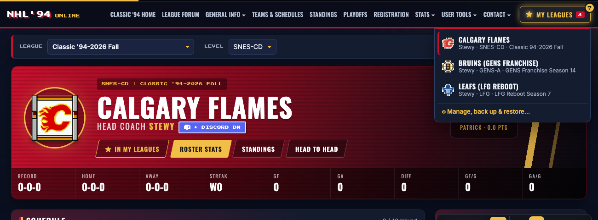
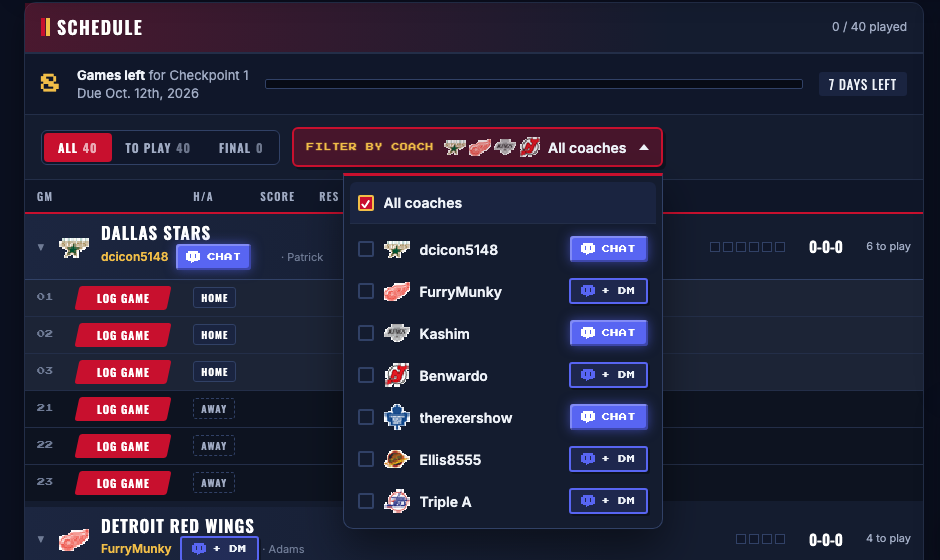
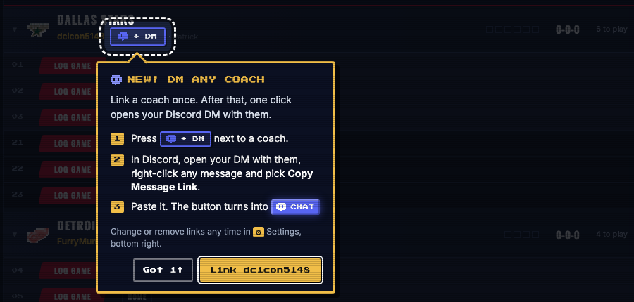
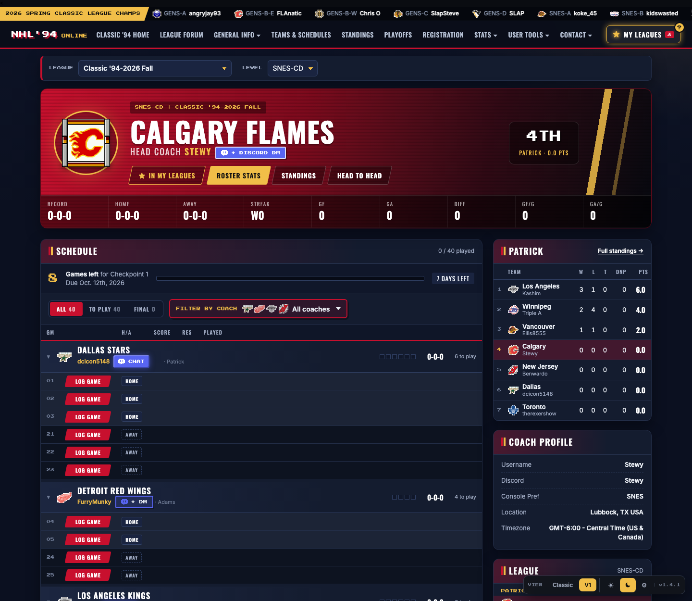
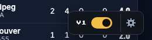
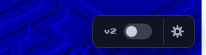
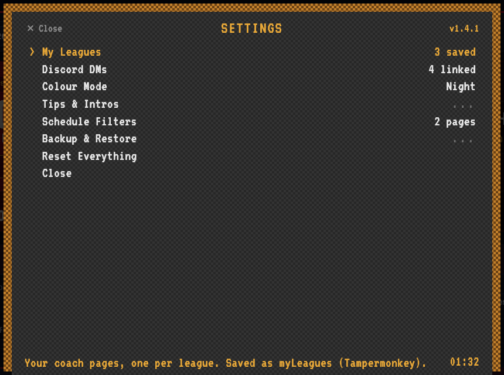

# NHL94 – It's In The Script 🏒

> *It started with just wanting a dark and night mode. Then things got a little out of hand.* 🌙

A Tampermonkey userscript that redesigns [nhl94online.com](https://nhl94online.com) page by page. The look mixes NHL 26 with 16-bit.

<h2 align="center">★ My Leagues</h2>

<b>Playing in more than one league? Save each of your teams once, then jump between them from the ★ My Leagues button on every page.</b>

Press <b>★ Add to My Leagues</b> on your coach page · rename and reorder · back up and restore with one file

<h2 align="center">💬 DM any coach on Discord</h2>

<b>See who you still have to play, then message them right away to set up a game.</b>

Press <b>+ DM</b> next to a coach and paste a message link from your Discord DM with them. The button turns into <b>CHAT</b>, and one click opens your DM. It works in the <b>Filter by Coach</b> dropdown, on every opponent and on the team card.

 First time on a coach page? A quick walkthrough shows you how.

🔒 Your links are <b>personal</b>: each one opens <i>your</i> private DM, so it won't work for anyone you share it with.

 

## What's new

**v2.1.0:** the "whole arena" update.
- 🏒 **Standings, rosters, stat leaders, records and box scores** all get the new look, in Day and Night.
- 🏆 **Standings with logos and coaches**, plus a ★ My Team box showing where you sit.
- 🎨 **Roster pages wear the team's colours**, with a stat strip and a DM button for the coach.
- 📺 **Broadcast-style box scores**: big logos, a pixel scoreboard and team-coloured stat bars.

See the full [changelog](CHANGELOG.md) for everything else.

## Before & after

| Classic (original site) | V1 · Rink Night |
| --- | --- |
|  |  |
|  |  Calgary's coach page: league bar up top, Filter by Coach, and the schedule grouped by opponent with Discord DM buttons |

<b>Day mode</b>

| Home (Day) | Coach page (Day) |
| --- | --- |
|  |  |

<b>Phone view</b>

## Install: pick your channel

**New to Tampermonkey?** Follow the **[step-by-step install guide](INSTALL.md)** for Chrome, Brave, Firefox and Edge.

1. Install [Tampermonkey](https://www.tampermonkey.net/) for your browser. On Chrome, Brave or Edge, also turn on **Allow User Scripts** in the extension's details.
2. Pick **one** channel, click its install link, then click **Install** on the Tampermonkey screen that opens:

   | Channel | What you get | Install |
   | --- | --- | --- |
   | 🥅 **Stable** (recommended) | Tested releases only. Steady as a stay-at-home defenceman. | **[Install Stable](https://raw.githubusercontent.com/codystewy/nhl94-its-in-the-script/stable/nhl94-its-in-the-script.user.js)** |
   | ⚡ **Latest** | Every change the moment it's made. Fresh off the bench, the odd wobble included. | **[Install Latest](https://raw.githubusercontent.com/codystewy/nhl94-its-in-the-script/latest/nhl94-its-in-the-script.latest.user.js)** |
   | 🎉 **Fun** | Latest plus playful extras that only live here. They come and go. The goal-horn edition. | **[Install Fun](https://raw.githubusercontent.com/codystewy/nhl94-its-in-the-script/fun/nhl94-its-in-the-script.fun.user.js)** |

3. Open [nhl94online.com](https://www.nhl94online.com) or any coach page.

The version at the top right of **⚙ Settings** shows which channel you're on. To switch, see [Switching channels](INSTALL.md#switching-channels).

**Redesigned pages so far:** Home, Coach, Standings, Team Rosters, Player Stat Leaders, League Records, All-Time User Standings, Site Records and Box Scores. Pages that haven't been redesigned yet look exactly like the original site.

Updates install automatically. Tampermonkey checks this repo about once a day: Stable updates when a new version is released, and Latest and Fun update with every change.

## Switching the new look on and off

| On | Off |
| --- | --- |
|  |  |

The bottom-right corner of every redesigned page has two controls:

- **The switch:** one click turns the new look (*Rink Night*, a dark NHL 26 broadcast look with 16-bit touches) on or off. Its label shows the script's version (**v2**). Off shows the original nhl94online.com page, untouched. **Alt + Shift + V** does the same.
- **The ⚙ gear** opens Settings (see below).

The page remembers your choice. New designs are added as new versions; old ones stay available.

## ⚙ Settings

The gear opens a menu styled after RetroArch's, so it feels right at home. Use the arrow keys and Enter (or the mouse), and ← / Esc to go back. From here you can:

- see your **My Leagues** and link coaches' **Discord DMs**
- switch **Colour Mode** between Day and Night (Night is the default)
- replay the **intros**
- clear one coach page's **schedule filters**
- **back up**, **restore** or **reset** everything

Every row says what it does and where it's saved, and anything that deletes needs a second press.

> 🔒 **Everything is stored only in your own browser.** There's no account and nothing is uploaded. A different browser or computer starts empty, so use **Backup & Restore** to bring your setup along.
>
> 💬 **Discord links are personal to you.** Each one opens *your* private DM with that coach. If you share a link (or your backup), it won't open anything for the other person. They link their own coaches.

**[📖 Full Settings guide, with screenshots of every menu →](docs/SETTINGS.md)**

## Development

- `nhl94-its-in-the-script.user.js`: the whole script. It has a page router (`PAGE`), shared data scraping, one renderer per page and version (`renderHomeV1`, `renderCoachV1`, …), and the version switcher.
- `dev/preview.sh [team_ID|home] [view]`: draws a live coach page with the script injected using headless Chrome, and saves a screenshot to `dev/out/`.
- Local live editing: install a small Tampermonkey script that `@require`s `file:///path/to/nhl94-its-in-the-script.user.js`. In Chrome you also need to turn on *Allow access to file URLs* for Tampermonkey. Edits then show up when you refresh the page.

- `dev/build-channel.sh <latest|fun>`: builds a channel's installable file into `dev/out/`. Preview it with `SCRIPT=dev/out/nhl94-its-in-the-script.latest.user.js dev/preview.sh`.

**Channels and releasing:** all work happens on `main`. Each install channel is its own branch:

| Branch | Updated | Version |
| --- | --- | --- |
| `stable` | Only on a release: the release commit is pushed to it | `@version` from the script, e.g. `1.5.0` |
| `latest` | On every push to `main`, by the [channels workflow](.github/workflows/channels.yml) | `@version` plus the commit count, e.g. `1.5.0.63` |
| `fun` | Same as `latest`, with `CHANNEL = 'fun'` so the extras listed in `FUN_EXTRAS` (gated with `funOn('id')`) switch on | Same as `latest` |

Tampermonkey only updates when the version goes up. The commit count makes sure every push counts as newer for Latest and Fun. Stable only changes when `@version` is raised at a release. Nobody edits the `latest` or `fun` branches by hand.

*Fan-made and not affiliated with EA Sports or the NHL. This repo has nothing to do with the [nhl94online.com](https://nhl94online.com/) community or its admins. It was simply started to add a night mode.*
