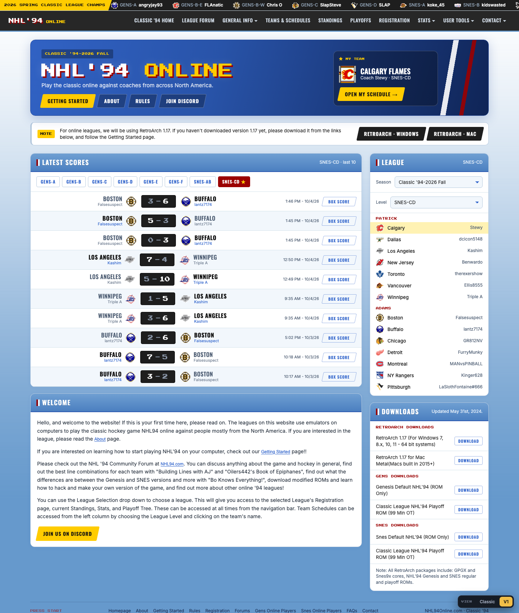
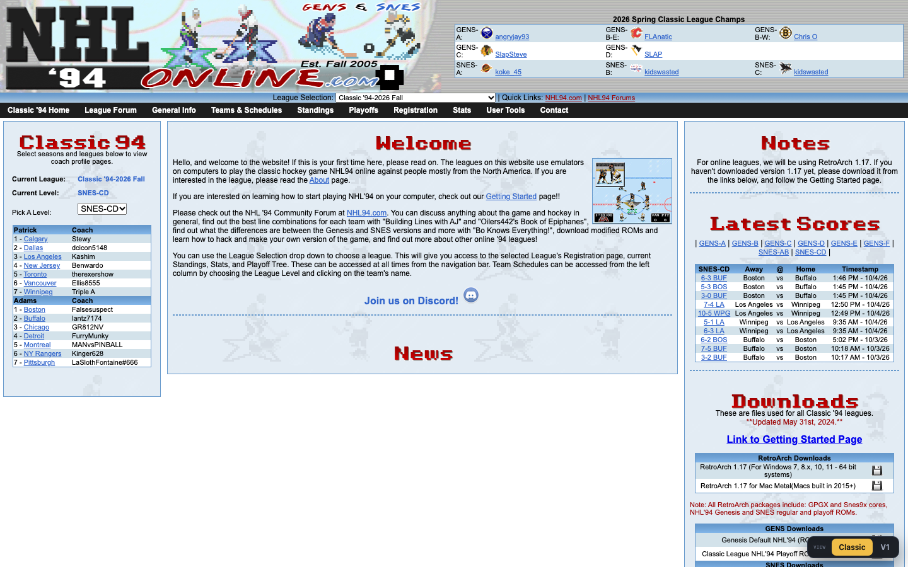
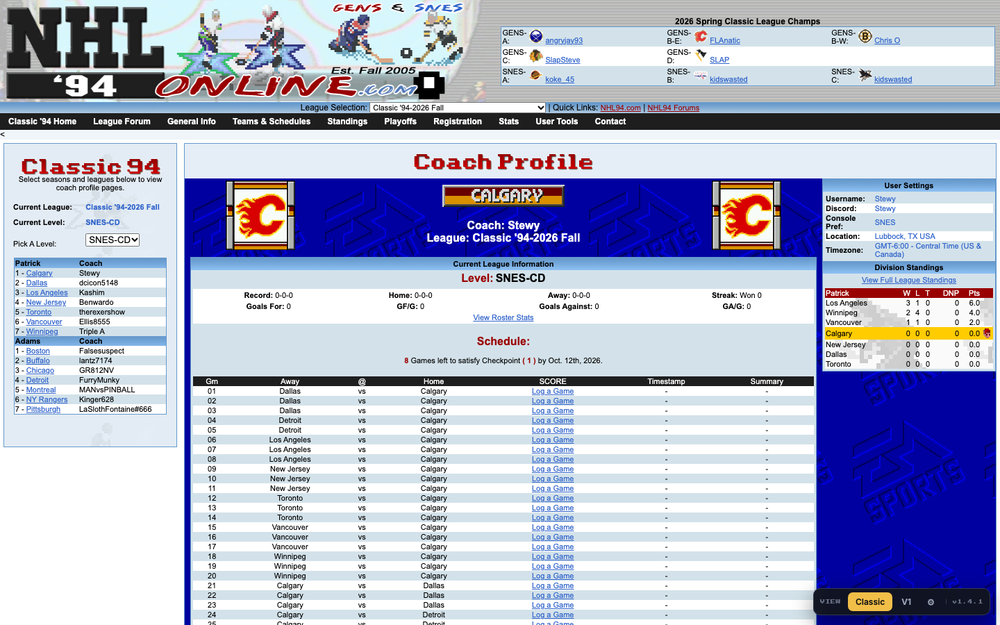
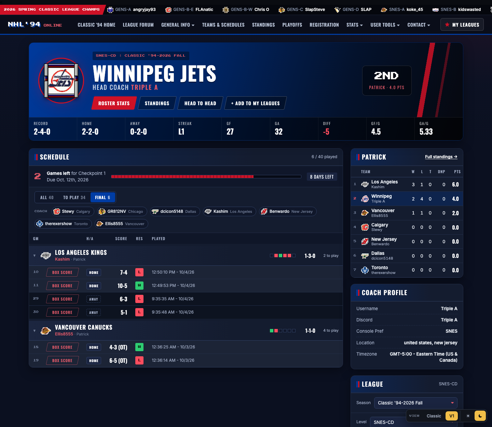
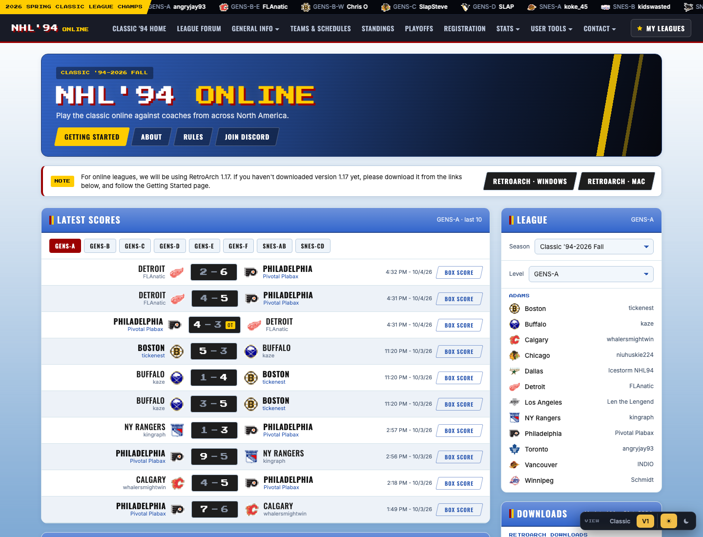
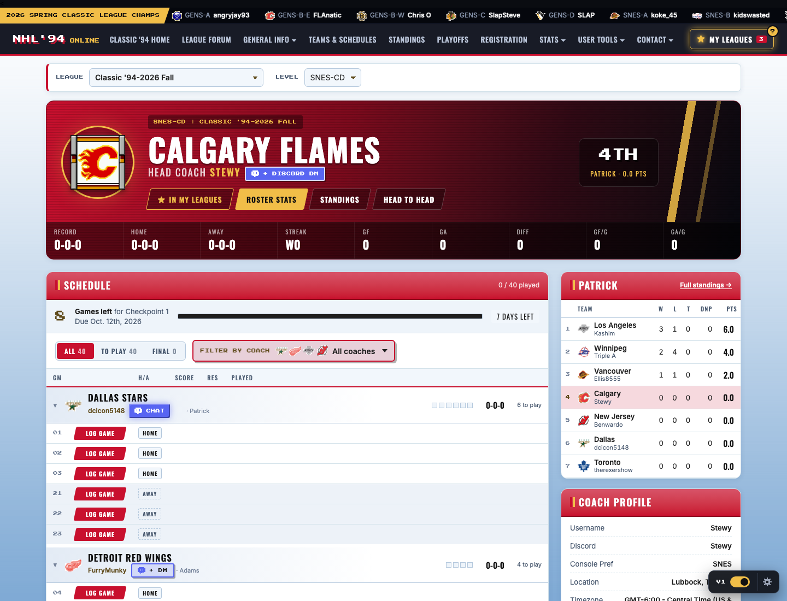
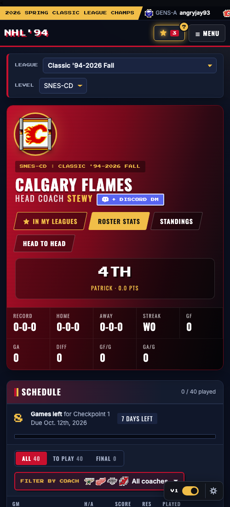

# NHL94 – It's In The Script 🏒

> *It started with just wanting a dark and night mode. Then things got a little out of hand.* 🌙

A Tampermonkey userscript that redesigns [nhl94online.com](https://nhl94online.com) page by page. The look mixes NHL 26 with 16-bit.

## What's new

**v1.4.1:** the big one.
- 🌙 **Lights out.** Day and Night mode on every page. Night is the default, because hockey is better after dark.
- 👕 **Every team wears its own jersey.** All 26 team pages come in their real 1993-94 colors.
- ★ **My Leagues.** Bouncing between leagues? Save your teams once and hop between them from anywhere. Back them up, restore them, or wipe the slate clean.
- 🏒 **Fixed:** the Rangers were hiding in the standings under a fake name ("New York"). We found them.

See the full [changelog](CHANGELOG.md) for everything else.

## Before & after

| Classic (original site) | V1 · Rink Night |
| --- | --- |
|  |  |
|  |  Coach page with the Final filter on: grouped by opponent, with coach names, results and OT tags |

<b>Day mode</b>

| Home (Day) | Coach page (Day) |
| --- | --- |
|  |  |

<b>Phone view</b>

## Install: pick your channel

**New to Tampermonkey?** Follow the **[step-by-step install guide](INSTALL.md)** for Chrome, Brave, Firefox and Edge.

1. Install [Tampermonkey](https://www.tampermonkey.net/) for your browser. On Chrome, Brave or Edge, also turn on **Allow User Scripts** in the extension's details.
2. Pick **one** channel, click its install link, then click **Install** on the Tampermonkey screen that opens:

   | Channel | What you get | Install |
   | --- | --- | --- |
   | 🥅 **Stable** (recommended) | Tested releases only. Steady as a stay-at-home defenceman. | **[Install Stable](https://raw.githubusercontent.com/codystewy/nhl94-its-in-the-script/stable/nhl94-its-in-the-script.user.js)** |
   | ⚡ **Latest** | Every change the moment it's made. Fresh off the bench, the odd wobble included. | **[Install Latest](https://raw.githubusercontent.com/codystewy/nhl94-its-in-the-script/latest/nhl94-its-in-the-script.latest.user.js)** |
   | 🎉 **Fun** | Latest plus playful extras that only live here. They come and go. The goal-horn edition. | **[Install Fun](https://raw.githubusercontent.com/codystewy/nhl94-its-in-the-script/fun/nhl94-its-in-the-script.fun.user.js)** |

3. Open [nhl94online.com](https://www.nhl94online.com) or any coach page.

The label at the right end of the VIEW switcher shows which channel you're on. To switch, see [Switching channels](INSTALL.md#switching-channels).

**Redesigned pages so far:** Home and Coach pages. Pages that haven't been redesigned yet look exactly like the original site.

Updates install automatically. Tampermonkey checks this repo about once a day: Stable updates when a new version is released, and Latest and Fun update with every change.

## Switching views

A **VIEW** switcher sits in the bottom-right corner of every redesigned page:

| View | What it is |
| --- | --- |
| **Classic** | The original nhl94online.com page, untouched |
| **V1** | *Rink Night*: a dark NHL 26 broadcast look with 16-bit touches |

Next to the views there's a **☀ Day / ☾ Night** toggle. Night is the default, and the choice applies to every page.

The page remembers your choices. Press **Alt + Shift + V** to cycle through the views. New designs are added as new versions; old ones stay available.

## What V1 gives you

**Home page**

- **Latest Scores** for each level, with team logos, coach names, the winner highlighted, OT tags and Box Score buttons.
- **★ My Leagues:** in a lot of leagues? Press **+ Add to My Leagues** on each of your coach pages. They show up in the **★ My Leagues** menu in the top bar on every page and on the home page, and your levels get a ★ in the score tabs. Under **Manage**, you can rename or reorder them, add one by pasting a coach page link, **download a backup** (JSON), **restore** it on another browser, or **clear** your history. Nothing leaves your browser and no login is needed.
- The RetroArch notice comes with direct Windows and Mac download buttons, and every league download is in one tidy list.
- League card: switch season and level, and see every team with its coach.

**Coach page**

- **Team colors:** every coach page is themed in that team's own colors (1993-94 era), in both Day and Night mode. The home page uses the original site's red, white and blue.
- **Coach names everywhere:** on the schedule, standings, filters and league list.
- **Schedule grouped by opponent:** one header per opponent with their logo, coach, your record against them, a box per game for wins and losses, and games left. Click a header to collapse it.
- **Filters:** All / To Play / Final tabs, plus coach pills you can switch on and off. Both are saved per coach page.
- **Checkpoint tracker:** games left, a progress bar and a countdown that turns red as the deadline gets close.
- **Quick actions:** **Log Game** and **Box Score** sit right next to each game.
- **Clear home and away rows:** home rows are lighter and away rows are darker.
- **Team info at a glance:** division rank, record splits, goal difference, and the full league directory with coaches.

## Development

- `nhl94-its-in-the-script.user.js`: the whole script. It has a page router (`PAGE`), shared data scraping, one renderer per page and version (`renderHomeV1`, `renderCoachV1`, …), and the version switcher.
- `dev/preview.sh [team_ID|home] [view]`: draws a live coach page with the script injected using headless Chrome, and saves a screenshot to `dev/out/`.
- Local live editing: install a small Tampermonkey script that `@require`s `file:///path/to/nhl94-its-in-the-script.user.js`. In Chrome you also need to turn on *Allow access to file URLs* for Tampermonkey. Edits then show up when you refresh the page.

- `dev/build-channel.sh <latest|fun>`: builds a channel's installable file into `dev/out/`. Preview it with `SCRIPT=dev/out/nhl94-its-in-the-script.latest.user.js dev/preview.sh`.

**Channels and releasing:** all work happens on `main`. Each install channel is its own branch:

| Branch | Updated | Version |
| --- | --- | --- |
| `stable` | Only on a release: the release commit is pushed to it | `@version` from the script, e.g. `1.5.0` |
| `latest` | On every push to `main`, by the [channels workflow](.github/workflows/channels.yml) | `@version` plus the commit count, e.g. `1.5.0.63` |
| `fun` | Same as `latest`, with `CHANNEL = 'fun'` so the extras listed in `FUN_EXTRAS` (gated with `funOn('id')`) switch on | Same as `latest` |

Tampermonkey only updates when the version goes up. The commit count makes sure every push counts as newer for Latest and Fun. Stable only changes when `@version` is raised at a release. Nobody edits the `latest` or `fun` branches by hand.

*Fan-made and not affiliated with EA Sports, the NHL or nhl94online.com.*
