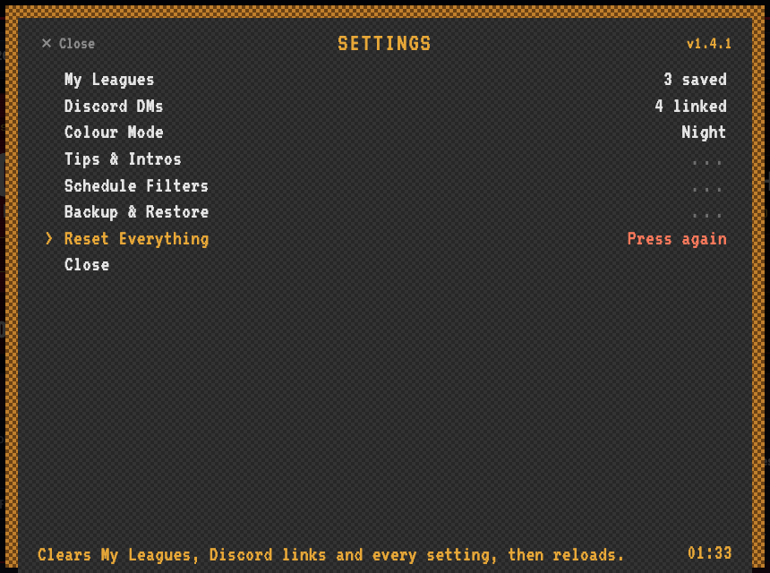
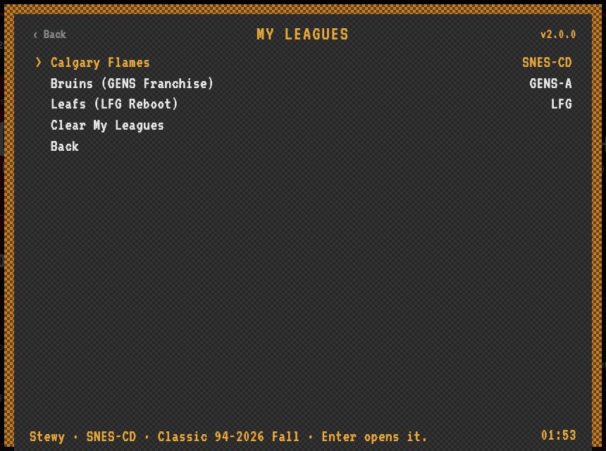
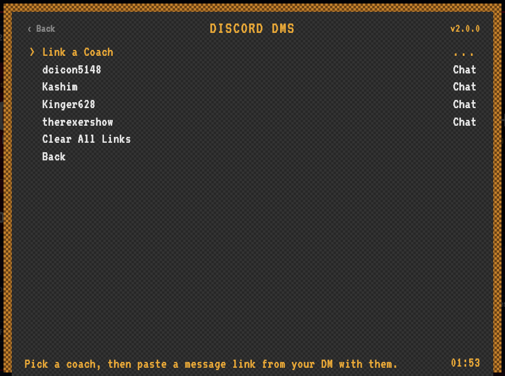
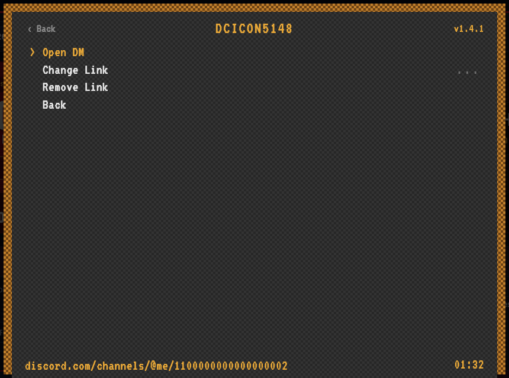
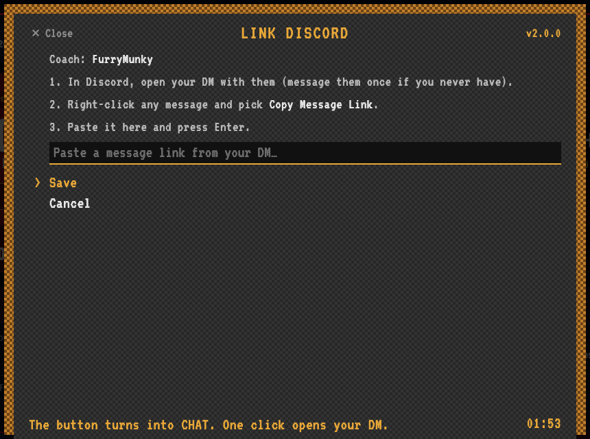
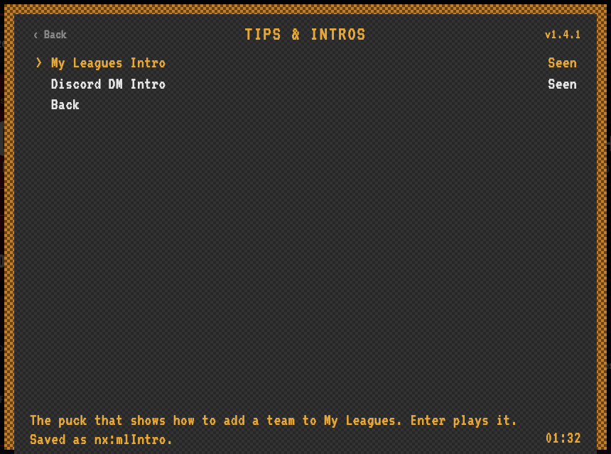
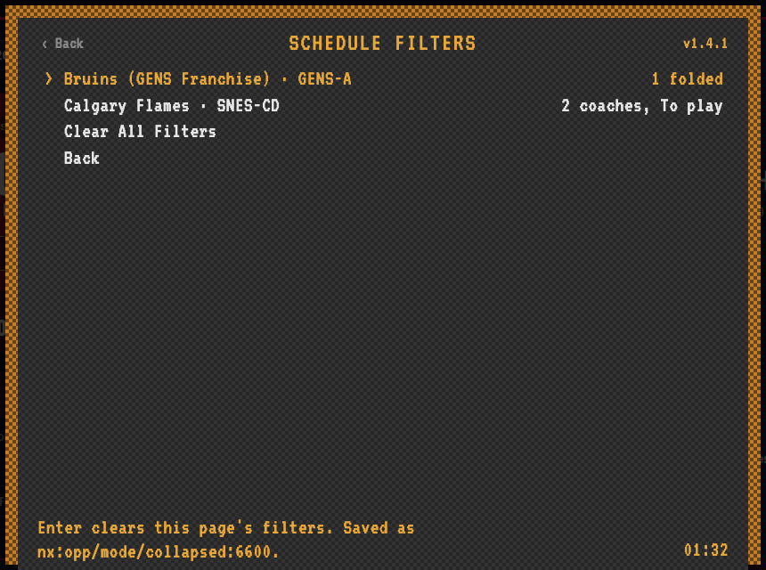
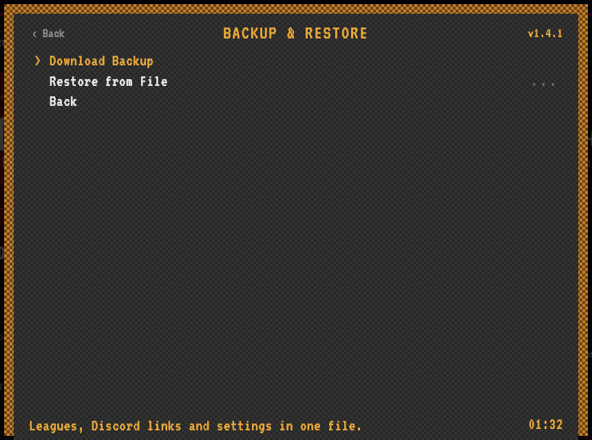

# ⚙ Settings

Click the **⚙ gear** in the bottom-right corner of any redesigned page. Settings opens as a menu styled after RetroArch's, so it should feel familiar.

> 🔒 **Everything here is saved only in your own browser.** There's no account, no server and nothing uploaded. Another browser, another computer or a private window starts empty. To move your setup, use [Backup & Restore](#backup--restore).

## Getting around

| Key | Does |
| --- | --- |
| **↑ / ↓** | Move the `>` cursor |
| **Enter** or **→** | Open the row (rows ending in `...` open a submenu) |
| **← / →** | Change a value in place, like Colour Mode |
| **Esc**, **←** or **Backspace** | Go back. On the main menu, close Settings |

The mouse works too: point at a row and click it. **‹ Back** / **✕ Close** sits in the top-left corner. The gold line along the bottom explains the highlighted row and says where that setting is saved.

Rows that delete something need **two presses**. The first press shows **Press again** in red, and the second press does it. If you wait a few seconds, it cancels itself.

## The bottom-right corner

| On | Off |
| --- | --- |
|  |  |

- **The switch** turns the new look on and off in one click. Off shows the original nhl94online.com page exactly as it is. **Alt + Shift + V** flips it from the keyboard.
- **The gear** opens Settings.

## My Leagues

The coach pages you saved with **★ Add to My Leagues**, one per league or level. Press Enter on one to open it. **Clear My Leagues** removes them all.

To rename or reorder them, use **★ My Leagues → Manage** in the top bar.

## Discord DMs

Link a coach once, and their **CHAT** button opens your Discord DM with them in one click. It's handy for asking "want to play?" right away.

- **Link a Coach** lists the coaches in the league you're looking at, plus **Type a Name** for anyone else.
- Pick a linked coach to **Open DM**, **Change Link** or **Remove Link**.
- **Clear All Links** forgets every link.

### Linking a coach

1. In Discord, open your DM with them. If you've never chatted, send them a message first.
2. Right-click any message in that DM and pick **Copy Message Link**.
3. Paste it and press **Enter**.

You can also press **+ DM** next to any coach name on a coach page (on the team card, beside each opponent, or in **Filter by Coach**). It opens this same page for that coach.

> ⚠️ **Your Discord links only work for you.** The link points to *your* private DM with that coach. Discord only opens it for the two people in that conversation. If you send it to someone else, or they restore your backup, it won't open anything for them. Everyone links their own coaches.

Profile links (`discord.com/users/…`) aren't accepted, because Discord can't open a DM from a profile. Links saved before that rule show **Profile** instead of **Chat** until you change them.

## League Discords

Each league and level (the **League** and **Level** pickers at the top of a coach page) can have its own Discord server. Press **+ League Discord** next to the Level picker, paste the link and press **Enter**. After that the button turns blue, and one click takes you to the league's Discord.

- Use a server invite (`discord.gg/…`) or a channel link (right-click the channel, **Copy Link**).
- **This League** links the league and level on the page you're on. Each saved league opens its link so you can change or remove it.
- **Clear All** forgets every league link.

## Colour Mode

**Day** or **Night**. Press Enter or ← / → on the main menu to switch. It applies to every redesigned page.

## Tips & Intros

Missed a walkthrough or skipped it too fast? Press Enter to play it again:

- **My Leagues Intro:** the puck that shows how to add a team to My Leagues.
- **Discord DM Intro:** the cursor that shows how to link a coach's DM.

## Schedule Filters

Each coach page remembers its own **Filter by Coach** picks, its **All / To Play / Final** tab and which opponents you folded up. This menu lists every page that has saved filters. Press Enter (twice) to clear one page, or use **Clear All Filters**. Reload the coach page to see the change.

## Backup & Restore

- **Download Backup** saves My Leagues, your Discord links and every setting into one `.json` file on your computer.
- **Restore from File** loads a backup on another browser or computer. Settings first shows what's in the file: how many leagues, links and settings. Nothing changes until you press **Restore** twice. Restoring **replaces** what's saved now, then reloads the page.

Keep the file to yourself. It holds your personal Discord DM links, and they're no use to anyone else anyway (see above).

## Reset Everything

Clears My Leagues, Discord links and every setting in this browser, then reloads the page. It's the same as a fresh install. Download a backup first if you might want any of it back.

## What's saved, and where

All of it stays in this browser:

| Setting | Saved as |
| --- | --- |
| My Leagues | `myLeagues` in Tampermonkey's storage (shared by `www.` and plain `nhl94online.com`) |
| Discord links | `coachLinks` in Tampermonkey's storage |
| Colour mode | `nx:theme` in the browser's storage for nhl94online.com |
| New look on / off | `nx:view` and `nx:lastView` |
| Intros seen | `nx:mlIntro`, `nx:dcIntro` |
| Schedule filters | `nx:opp:<team>`, `nx:mode:<team>`, `nx:collapsed:<team>` (one set per coach page) |

[← Back to the README](../README.md)
